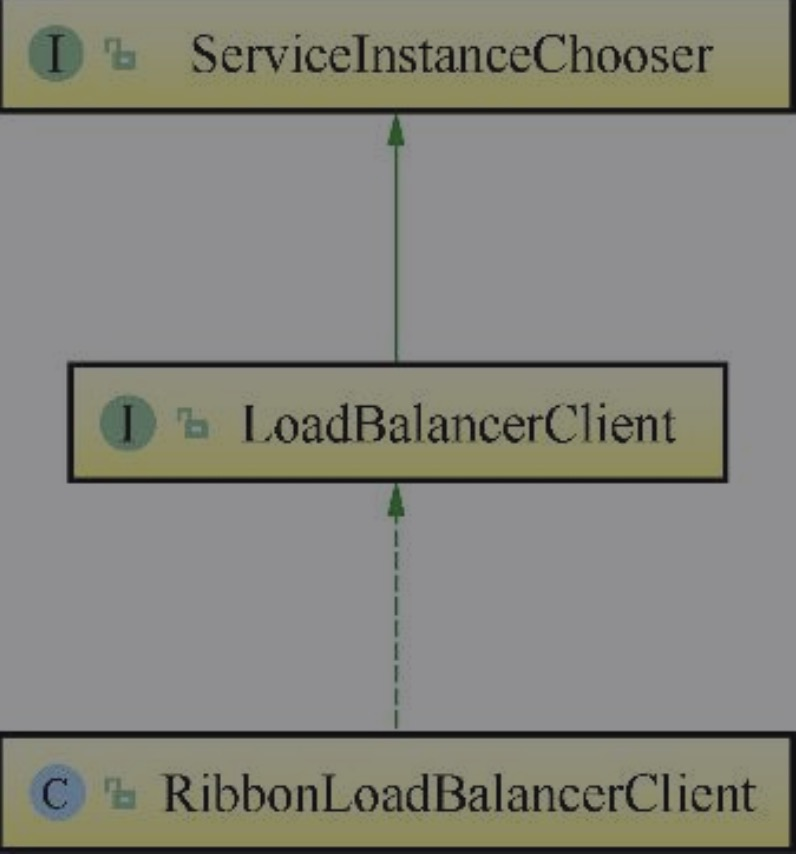

在Spring Cloud构建的微服务系统中，Ribbon作为服务消费者的负载均衡器，有两种使用方式，一种是和RestTemplate相结合，另一种是和Feign相结合。

##### Ribbon的负载均衡简单校验
###### 编写控制器代码
```
/**
 * @author 莫轩然
 * @date 2020/5/26 16:17
 */
@RestController
public class RestTestController {
    @Autowired
    LoadBalancerClient loadBalancerClient;

    @GetMapping("/testRibbon")
    public String testRibbon(){
        ServiceInstance instance = loadBalancerClient.choose("apo-outer-user");

        return instance.getHost() + ":" + instance.getPort();
    }


}
```
多次调用localhost:8082/testRibbon交替返回(本机启用两个apo-outer-user服务实例，分别为8083端口和8084端口)
```
localhost:8083
localhost:8084
```
由此我们可见，LoadBalancerClient实现了负载均衡的功能，但它具体是如何实现的呢？

###### 源码分析Ribbon
我们跟踪LoadBalancerClient的源码，它是一个接口类，继承了ServiceInstanceChooser，它的实现类是RibbonLoadBalanceClient。
类关系图如下：



